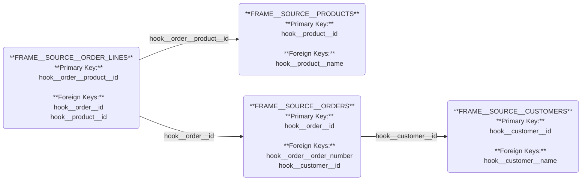
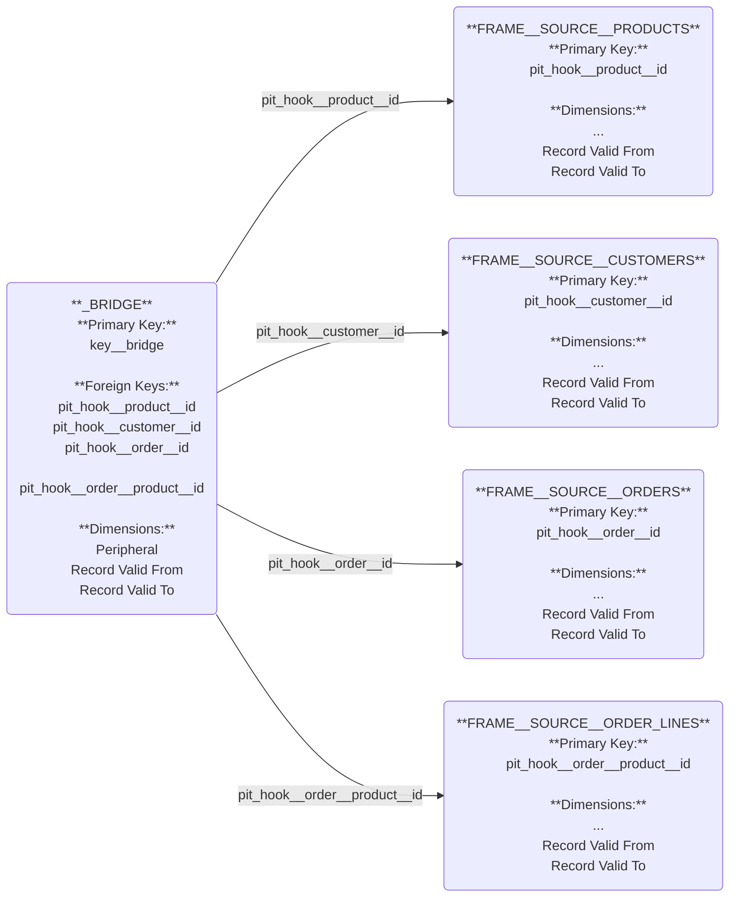

# Documentation

## Hook

```mermaid
flowchart LR
    %% Entities
    frame__source__products("
        **FRAME__SOURCE__PRODUCTS**
        **Primary Key:**
        hook__product__id
        &nbsp;
        **Foreign Keys:**
        hook__product__name
    ")

    frame__source__customers("
        **FRAME__SOURCE__CUSTOMERS**
        **Primary Key:**
        hook__customer__id
        &nbsp;
        **Foreign Keys:**
        hook__customer__name
    ")

    frame__source__orders("
        **FRAME__SOURCE__ORDERS**
        **Primary Key:**
        hook__order__id
        &nbsp;
        **Foreign Keys:**
        hook__order__order_number
        hook__customer__id
    ")

    frame__source__order_lines("
        **FRAME__SOURCE__ORDER_LINES**
        **Primary Key:**
        hook__order__product__id
        &nbsp;
        **Foreign Keys:**
        hook__order__id
        hook__product__id
    ")

    %% Relations
    frame__source__order_lines -- hook__order__id --> frame__source__orders
    frame__source__order_lines -- hook__order__product__id --> frame__source__products

    frame__source__orders -- hook__customer__id --> frame__source__customers

```

## Unified Star Schema

```mermaid
flowchart LR
    %% Entities
    bridge("
        **_BRIDGE**
        **Primary Key:**
        key__bridge
        &nbsp;
        **Foreign Keys:**
        pit_hook__product__id
        pit_hook__customer__id
        pit_hook__order__id
        pit_hook__order__product__id
        &nbsp;
        **Dimensions:**
        Peripheral
        Record Valid From
        Record Valid To
    ")
    source__products("
        **FRAME__SOURCE__PRODUCTS**
        **Primary Key:**
        pit_hook__product__id
        &nbsp;
        **Dimensions:**
        ...
        Record Valid From
        Record Valid To
    ")

    source__customers("
        **FRAME__SOURCE__CUSTOMERS**
        **Primary Key:**
        pit_hook__customer__id
        &nbsp;
        **Dimensions:**
        ...
        Record Valid From
        Record Valid To
    ")

    source__orders("
        **FRAME__SOURCE__ORDERS**
        **Primary Key:**
        pit_hook__order__id
        &nbsp;
        **Dimensions:**
        ...
        Record Valid From
        Record Valid To
    ")

    source__order_lines("
        **FRAME__SOURCE__ORDER_LINES**
        **Primary Key:**
        pit_hook__order__product__id
        &nbsp;
        **Dimensions:**
        ...
        Record Valid From
        Record Valid To
    ")

    %% Relations
    bridge -- pit_hook__product__id --> source__products
    bridge -- pit_hook__customer__id --> source__customers
    bridge -- pit_hook__order__id --> source__orders
    bridge -- pit_hook__order__product__id --> source__order_lines

```